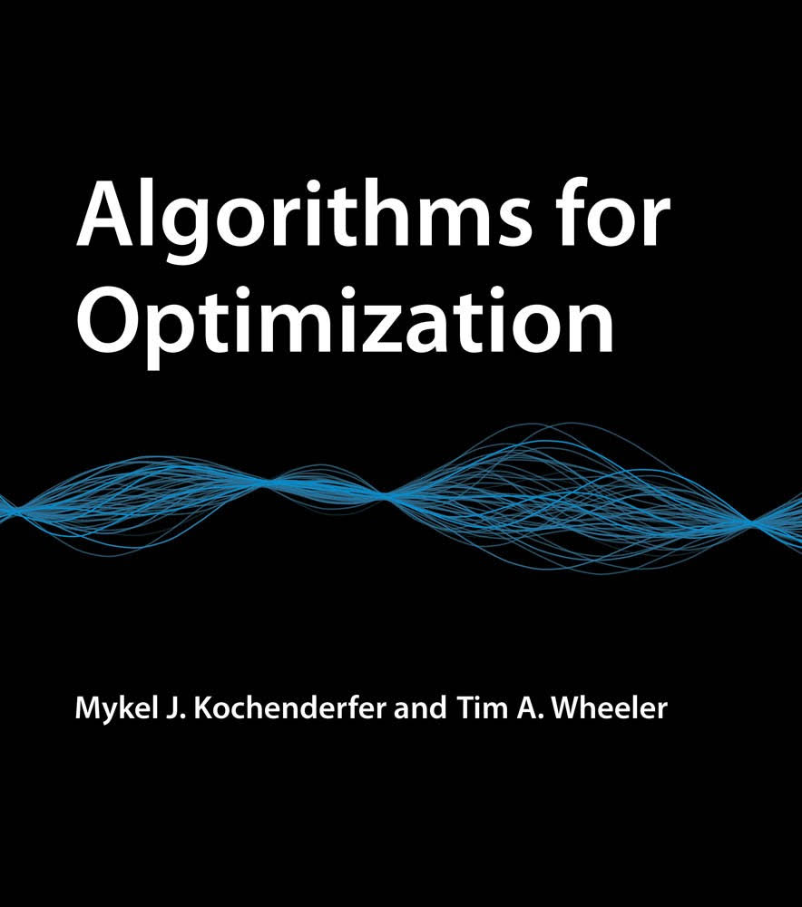

  

Hello, in this repository I will document my notes on the book "<a href="https://mitpress.mit.edu/books/algorithms-optimization">Algorithms for Optimization</a>" from Mykel J. Kochenderfer and Tim A. Wheeler using <a href="https://github.com/fonsp/Pluto.jl">Pluto.jl</a> in Julia.

# [Chapter 1 - Introduction](https://marcovela.github.io/AlgorithmsForOptimization/chapter-1/)
First chapter states that everything in our lives can be optimized, and every optimization problem can be translated into minimizing an objective function.

# [Chapter 2 - Derivatives and Gradients](https://marcovela.github.io/AlgorithmsForOptimization/chapter-2/)
Second chapter introduce the notion of derivatives in multiple dimensions and how to approximate derivatives using numerical methods, noting that the use of the dual numbers and the complex step method can give us great approximations compared with traditional methods.

# [Chapter 3 - Bracketing](https://marcovela.github.io/AlgorithmsForOptimization/chapter-3/)
Third chapter presents method for finding intervals which contain a local minimum and how to reduce it (approximating the minimal), these methods have different constraints, Fibonacci search is constrainted by the number of times we can call the function, Quadratic search by how well can a parabola fit a bracket and Shubert-Piyavskii method by the requirement of an upper bond of the derivative of f in the bracket interval.

# [Chapter 4 - Local Descent](https://marcovela.github.io/AlgorithmsForOptimization/chapter-4/)
Fourth chapter presents method for finding directions and steps sizes for reaching a local minimum of a multivariate function. Finding optimal direction and step sizes are in its own optimization problems. The Line Search method uses a given direction to optimize the step size to a set of conditions (Wolfe conditions) or can create a univariate optimization problem (optimize step size alpha). Trust region method uses a given step size, finding the smaller point in that region, contracting or expanding according to certain criteria.

# [Chapter 5 - First-Order Methods](https://marcovela.github.io/AlgorithmsForOptimization/chapter-5/)
Fifth chapter introduces the First-Order Methods, such as gradient descent and its variations (more efficient by the way), these techniques use the negative of the gradient as the direction of greater decrement, in combination with the line search for determining an optimal step size, achieve fast convergence (with some little tricks). These tricks include momentum, and adapting the learning rate for each step (applying optimization methods to it). The most important methods are Conjugate gradient, Adam, Nesterov momentum and the hypegradient optimization.